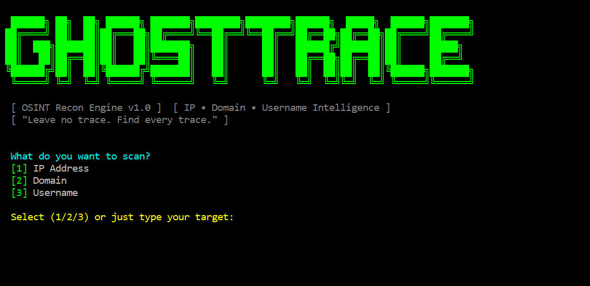
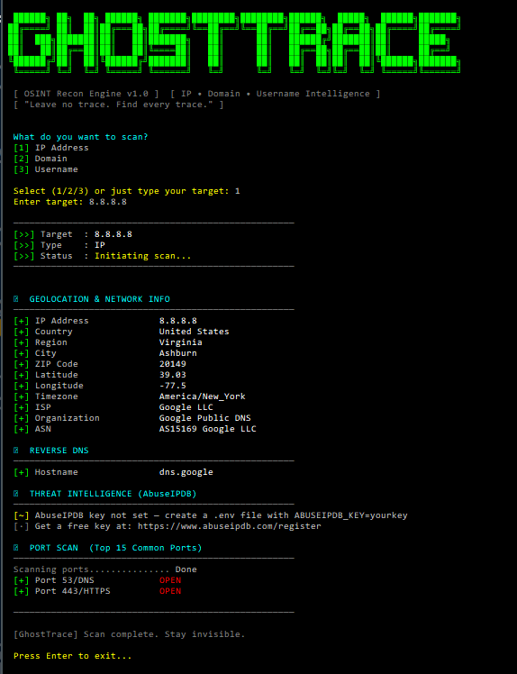
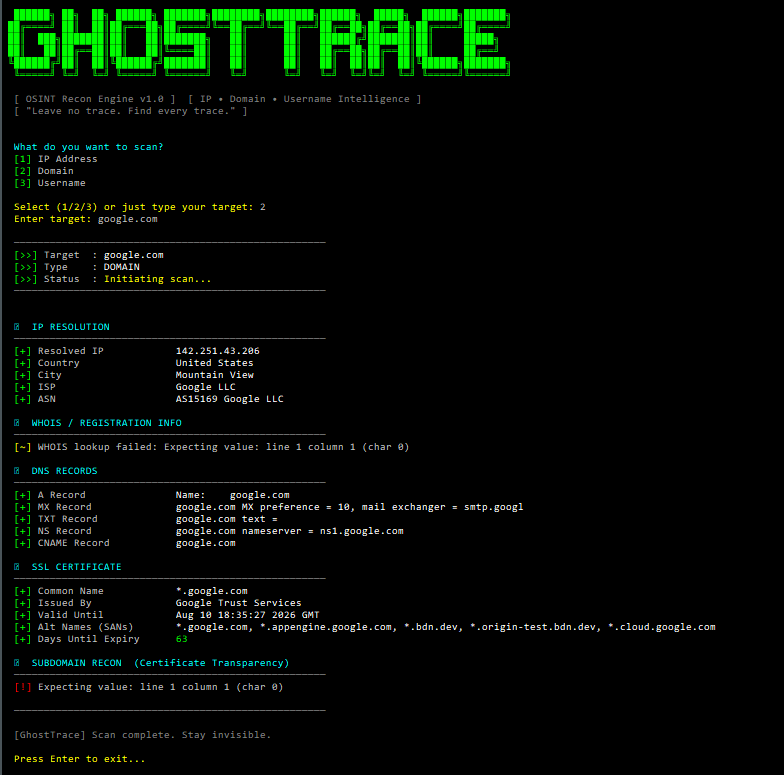
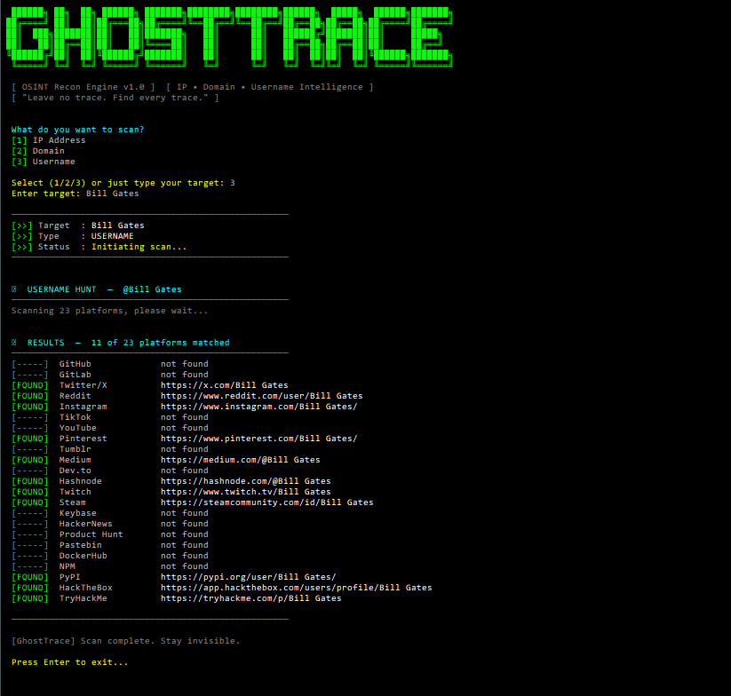

# ghosttrace-osint

`ghosttrace-osint` is an OSINT reconnaissance tool for IP addresses, domains, and usernames.

## Install

Install this package from PyPI:

```bash
pip install ghosttrace-osint
```

On Windows, installation now attempts to auto-fix user PATH and also installs a `ghosttrace.bat` launcher.
After install, open a new terminal window and run:

```bash
ghosttrace example.com
```

## Install From Source

If you want to run `ghosttrace-osint` from the repository instead of PyPI:

```bash
git clone https://github.com/Mishen-BMA/ghosttrace.git
cd GhostTrace
pip install -r requirements.txt
pip install -e .
```

Then run it with:

```bash
ghosttrace example.com
```

## Usage

The command is `ghosttrace`:

```bash
ghosttrace example.com
ghosttrace 8.8.8.8
ghosttrace johndoe
```

You can also save a report:

```bash
ghosttrace example.com -o report.json
```

If you want to force the target type:

```bash
ghosttrace 8.8.8.8 -t ip
ghosttrace example.com -t domain
ghosttrace johndoe -t username
```

If `ghosttrace` is not recognized in Windows CMD/PowerShell after install, try the included fixer:

```powershell
py -m ghosttrace.post_install
```

If the `ghosttrace-fixpath` console script was installed and is on PATH, you can run instead:

```powershell
ghosttrace-fixpath
```

After running the fixer, close and reopen your terminal, then run:

```powershell
ghosttrace --help
```

Recommended: use `pipx` for CLI tools to avoid PATH issues:

```powershell
py -m pip install --user pipx
py -m pipx ensurepath
py -m pipx install ghosttrace-osint
```

## Configuration

- **AbuseIPDB key**: To enable AbuseIPDB threat lookups set the `ABUSEIPDB_KEY` environment variable or create a `.env` file with `ABUSEIPDB_KEY=yourkey`. If not set, the tool skips AbuseIPDB checks.
- **Non-interactive runs**: Use `--no-prompt` (or `-n`) to avoid the final press-Enter prompt when running in scripts or CI: `ghosttrace example.com --no-prompt`.
- **Remove local PyPI token**: If you created or used a `~/.pypirc` file for publishing, remove it after publishing to avoid leaving tokens on disk.

## Screenshots

Main view:



IP scan:



Domain scan:



Username scan:



Windows PowerShell:

```powershell
Remove-Item -Path $env:USERPROFILE\.pypirc -Force
```

Unix / Git Bash:

```bash
rm ~/.pypirc
```

## Project Structure

```text
GhostTrace/
├── ghosttrace.bat
├── setup.py
├── setup.cfg
├── pyproject.toml
├── README.md
├── LICENSE
├── MANIFEST.in
├── requirements.txt
└── ghosttrace/
	├── __init__.py
	├── __main__.py
	└── modules/
		├── __init__.py
		├── colors.py
		├── banner.py
		├── detector.py
		├── ip_lookup.py
		├── domain_lookup.py
		├── username_lookup.py
		└── reporter.py
```
